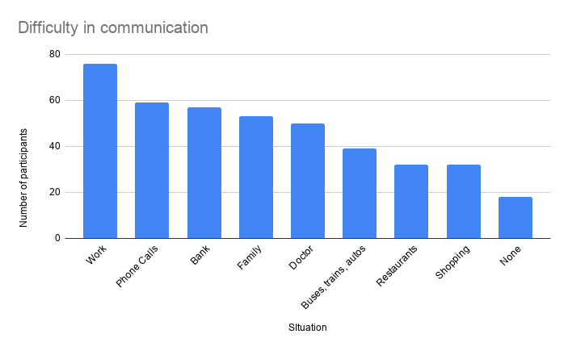
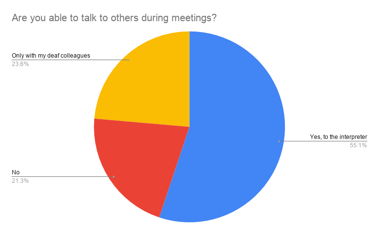
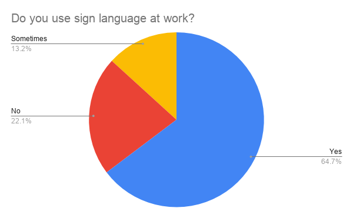

# The ASSIST Project

The ASSIST project aims to make the world more accessible by helping the Deaf and Hard of Hearing DHH) community in India. Our aim is to build an AI powered Indian Sign Language (ISL) Translator, to enable easier communication between the DHH and hearing communities in work places. 

Our plan was decided based on feedback obtained from the deaf community, and we seek to involve them in all our decisions. Based on a survey we conducted amongst the DHH community, we learnt that:

Our survey shows that DHH community faces the biggest challenge at the workplace, with 56% of participants reporting difficulties there. Workplace difficulties rank higher than any other situation - such as banks, while shopping, at restaurants, with family etc.

Communication is the biggest challenge for the deaf community at work. By conducting interviews with deaf participants, we learnt that they find it difficult to talk to their hearing managers and colleagues. The community is only able to talk to an interpreter or to other deaf colleagues, and this prevents them from being able to talk about serious work issues such as appraisals, promotions, salary hikes and other work-related matters. 

Interestingly, 78% of our survey respondents said they use sign language at work. This clearly shows that their preferred means of communication at work is through ISL, even if it difficult for the hearing community to understand them today. 

Therefore, we aim to build a solution that allows the DHH community to continue conversing in their preferred medium of sign language, while also allowing the hearing community to understand them easily. With the rise of video calling applications and work-from-home, we believe that inegrating a sign language interpreter into video calling apps like Microsoft Teams should should ease the problem of workplace communication, and level the playing field for the DHH community at work.  
