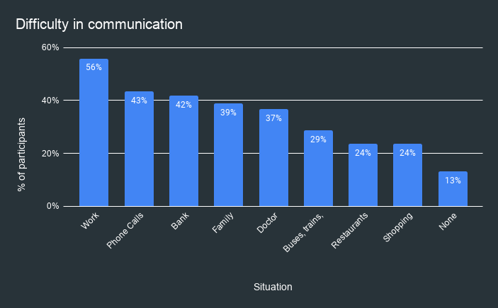

# The ASSIST Project

The ASSIST project aims to make the world more accessible by helping the Deaf and Hard of Hearing DHH) community in India. Our aim is to build an AI powered Indian Sign Language (ISL) Translator, to enable easier communication between the DHH and hearing communities in work places.

We're thankful to be recipients of Microsoft's AI For Accessibility Grant, 2021. To know more about our plans for the year, check out our [Project Plan](/cslr/Plan.md) section.

 Image courtesy Prakash Singh, scroll.in 

We seek to involve the DHH community in all our decisions. By conducting surveys and interviewing deaf participants, we learnt that:

The DHH community faces the largest challenges at the workplace, with 56% of our survey participants reporting difficulties in communicating with office colleagues. Workplace difficulties rank higher than any other situation - such as banks, while shopping, at restaurants, with family etc.

Communication is the biggest challenge for the deaf community at work. By conducting interviews with deaf participants, we learnt that they find it difficult to talk to their hearing managers and colleagues. The community is mainly only able to talk to an interpreter or to other deaf colleagues at work, and this prevents them from being able to voice concerns about serious work issues such as appraisals, promotions, salary hikes and other work-related matters. 

Interestingly, 78% of our survey respondents said they use sign language at work. This clearly shows that their preferred means of communication at work is through ISL, even if it difficult for the hearing community to understand them today. It is on us to make workplaces more accessible, by allowing the DHH community to use their preferred means of communication - ISL - while ensuring that this does not hamper their ability to communicate.

Therefore, we aim to build an AI powered translator, that allows the DHH community to continue conversing in ISL and enables the hearing community to understand them easily. With the rise of video calling applications and work-from-home (78% of our survey respondents work from home), we believe that inegrating a sign language interpreter into video calling apps like Microsoft Teams should should ease the problem of workplace communication, and level the playing field for the DHH community at work.  
